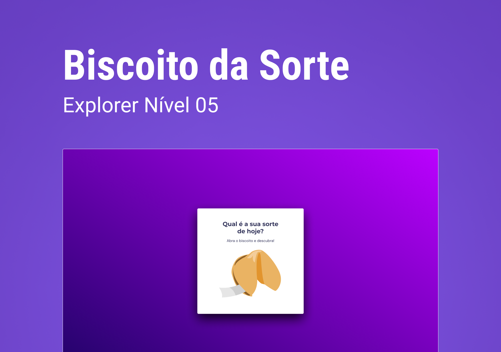

# Stage 05 - Challenge 01

## ⚔️ **Desafio - Biscoito da Sorte**

### Biscoito da Sorte é um jogo no qual o usuário, a partir de um clique ou enter, abre um biscoito com a sua sorte do dia.

#### Projeto desenvolvido no nível 05 do programa de formação Explorer da Rocketseat.

 

 

## 📝 **Conceitos trabalhados**

**HTML e CSS**

- Estrutura HTML;
- Posicionamento e alinhamento dos elementos;
- Animações, transições e transformações;
- Arrays;
- Funções callback;
- Minupulação da DOM;
- Bliblioteca JS Math().

#### 👉🏽 Clique **[aqui](https://eduardofariasdev.github.io/stage05-fortune-cookie/)** e abra esse projeto no seu seu navegador.

 

🚀 **Projeto desenvolvido no programa de formação Explorer da Rocketseat.**
